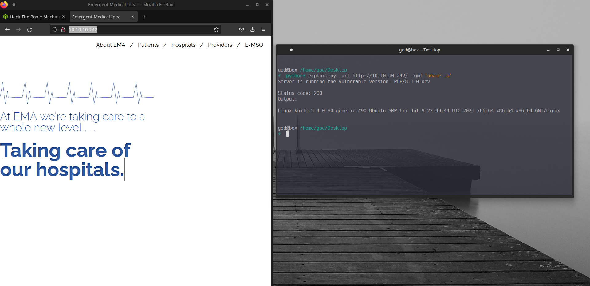

# Python based backdoor exploit script for PHP/8.1.0-dev

## Description:
>On the 28th of March 2021 a backdoor was placed within PHP version 8.1.0-dev.
>[Read More Here](https://arstechnica.com/gadgets/2021/03/>hackers-backdoor-php-source-code-after-breaching-internal-git-server/)<br>
>This script will let you easily connect to this backdoor and execute commands on the machine.


## Installation steps:

Cloning the repo:
```
git clone https://github.com/0xP4UL/PHP-8.1.0-dev-Backdoor-POC.git
```

Installing requirements:
```
cd PHP-8.1.0-dev-Backdoor-POC; pip3 install -r requirements.txt
```

## Launching the script:

Launching the script with the required arguments

```
python3 php8_1_0-dev-poc.py -url https://example.com/ -cmd 'uname -a'
```


